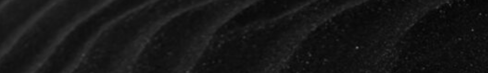
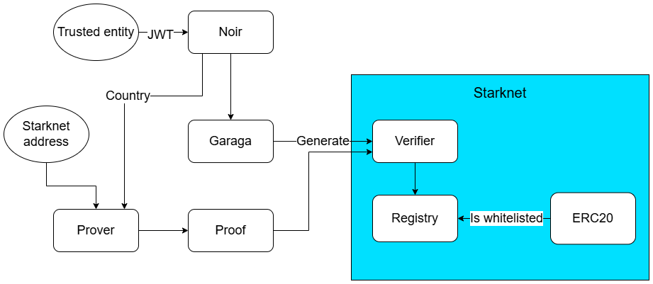

# StarkComply

StarkComply combines Noir privacy with a compliant Starknet token.

The project utilizes the following building blocks:
- A Noir circuit for verifying user's country.
- [Garaga](https://github.com/keep-starknet-strange/garaga) library for generating a Cairo verifier for the Noir circuit.
- A Cairo registry contract that whitelists addresses that have a valid Noir proof.
- A Cairo ERC20 token that can be transferred only if the recipient is whitelisted in the registry.

This project can be utilized for creating tokens that require privacy-preserving compliance (a CBDC or a stablecoin, for example).

This project was originally started in the [NoirHack hackathon](https://www.noirhack.com/).

## Architecture

### User flow

1. The user provides a [JWT](https://jwt.io/) JSON disclosing the user's country. The signed JWT is received from a trusted source for example an SSI wallet as JWT VC.
1. User signs up with their Starknet wallet, providing a Starknet address.
1. A Noir circuit verifies the JWT, extracts the country information, verifies that it's in a list of allowed countries, adds the address and generates a ZK proof.
1. The user invokes a Cairo registry contract to register the Starknet address with the proof. The registry contract verifies the proof and adds the address in a whitelist.
1. Once the address has been whitelisted, the user can receive (and subsequently, transfer) the Cairo ERC20 token.

## Resources

### Videos

A full project presentation can be found [here](TODO). To have a look at just the website demo, you can check [here](https://www.youtube.com/watch?v=bVqy2nINLAw).

### Website

The project can be used through its website at https://starkcomply.vercel.app .

### Contracts

The Cairo contracts used by the frontend are the following:
- Registry contract: https://sepolia.voyager.online/contract/0x0540eeb8cff58b6696cfd192f9afbbdb406fcea24825157390d29c9300001f15
- ERC20 contract: https://sepolia.voyager.online/contract/0x0603fcfabd24c4ce314fb524bbb6527ede5f6fd478d7471958f257a29b41146a
- The verifier contract is used only as a library, therefore no explicit deployment is done for it. Its used class hash is [0x040408b7c73092d7b26770ea4b72cf491234b94ccd9f4bd33545f5fd2f15b3e1](https://sepolia.voyager.online/class/0x040408b7c73092d7b26770ea4b72cf491234b94ccd9f4bd33545f5fd2f15b3e1).

## Privacy and circuits

The project utilizes JWT tokens from a trusted source to establish the user's nationality. This source could be something like [ZKPassport](https://github.com/zkpassport) or SSI wallet utilising StarkComply SDK, but these integrations are planned for post-hackathon development.

All of the inputs to the Noir circuit are private (except the Starknet address) - the exact nationality is never disclosed.

### Circuit

The Noir circuit has a size of 69165 gates, resulting in 14146 ACIR opcodes. The used prover flavor is Ultra Honk.

Since the circuit is rather small, proving times are not an issue. It requires just a few seconds to generate a proof - in the backend.

Unfortunately, we could not get the real circuit to work through the frontend. Generating a Cairo verifier for it resulted in too big a contract - Starknet has a limit of 81290 felts and we were unable to optimize the circuit any further, to get under the limit. Therefore, the website uses a dummy circuit. Check the circuit folder's [README](/circuit/README.md) for more details.

## Installation

The installation instructions depend on which part you want to do yourself and where do you want to use a ready solution.

- For running just the website with predeployed contracts, please check the [README](/app/README.md) in the `app` folder.
- For rebuilding the circuit, regenerating verifier and redeploying the contracts, please check the instructions [here](INSTALLATION.md).

Unfortunately, running all of the project's components locally is not possible, due to limitations in Starknet wallets. Therefore, all of the instructions guide you to use Starknet Sepolia.

## Acknowledgements

This project was forked from the template repository [scaffold-garaga](https://github.com/m-kus/scaffold-garaga). Thanks to the original authors for laying the foundation that made StarkComply possible.
